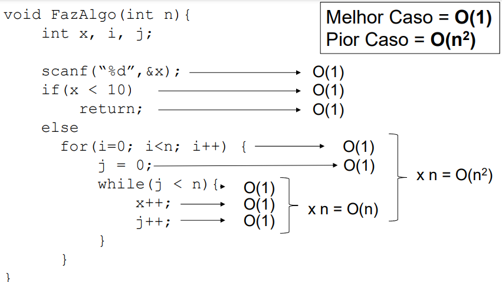

# Data Structures Study

A deep study about Data Structures with help of C language

## Algorithm Complexity Analysis

The algorithm efficiency can be measured in a lot of ways, the most famous are:

- Temporal complexity.
- Spatial complexity.

### Specific Algorithm Analysis

We try to understand how much it costs for an specific algorithm to solve a problem.

These are some of the characteristics we study about the algorithm:

- How many times each part of the algorithm must be executed.

- How much memory is needed for the algorithm data structures.

### Algorithm Class Analysis

We try to understand what is the algorithm with the less possible cost to solve a particular problem (per example, ordering and searching algorithms).

All the algorithm family is studied. So we try to find the better one. Being minded about it, we can create limits for the computational complexity of the algorithms that belong to that family.

### Cost Measurement

If we use the same cost measure for different algorithms, we are able to compare them and choose the better one.

We can measure the algorithm cost in the following ways:

#### Algorithm Execution

Most of the time this measurement is not the better one, since the results depends on compiler, hardware and memory utilization.

Even though, sometimes it is a good measurement when we need to compare distinct algorithms to solve the same problem and they have the same order of magnitude or we need to make an analysis of how the algorithm behave in the context it will be applied.

#### Mathematical Model

We use a mathematical model based on a idealized computer.

Usually we use the RAM Model (Random Access Machine):

- A processor that executes an action per time.

- A memory that stores the data.

- Basic operations with constant cost (memory access, conditionals, arithmetic operation, etc.).

We need to specify the algorithm operations and their execution costs (usually we only consider the cost of the most significant operations).

### Algorithm Cost

When we determine the cheaper cost possible to solve a algorithm class problem, we find the inherently difficult to solve that problem.

A top algorithm is the one with cost equals to the cheaper problem cost. 

### Complexity Function

The execution cost of a algorithm is found by a cost function, or complexity function.

**f(n)** is the cost measurement needed to execute a algorithm with size of **n**.

- **Temporal Complexity Function:** **f(n)** measures the cost in number of operations to execute a algorithm in a problem of size **n**.

- **Spatial Complexity Function:** **f(n)** measures the memory needed to execute a algorithm in a problem of size **n**.

In general, we use **f(n)** as a temporal complexity function, but, be minded that it does not represent the time directly, instead, it represents the amount of times a specific operation considered to be relevant is executed.

#### Example: Find max number in an array.

The cost is **F(n) = n - 1** since we have a loop with **n - 1** iterations in which we make a comparison.

```c
int maxValue (int *A, int n) {
	int i, temp;

	temp = A[0];

	for (i = 1; i < n; i++) {
		if (temp < A[i]) {
			temp = A[i];
		}
	}

	return temp;
} 
```

The execution cost measurement of an algorithm is a function with the same size of the data input.

In some algorithms, the execution cost depends on the data organization as well. In these cases, we will have different complexity functions to represent the best, worst and average case.

- **Best case:** Least execution time in all the input of size **n**.

- **Worst case:** Biggest execution in all input of size **n**.

- **Average case:** Average of all execution time of all input of size **n**.
	- (best case + worst case) / 2

#### Example: Sequential search (each record has an unique key).

The **best case** is when the record is the first one read: **F(n) = 1**.

The **worst case** is when the record is the last one read or it is not even on the store: **F(n) = n**.

The **average case** is when the record is in the middle of the store: **F(n) = (n + 1) / 2**.

```c
int searchIndex (Store *A, int n, int key) {
	int i;

	i = 0;

	while(i < n) {
		if (A[i].key == key) {
			break;
		}

		i++;
	}

	return i;
}
```

### Algorithms Comparison

When we compare algorithms of the same class, sometimes we are able to understand what is the limit inferior of that class.

The limit inferior shows us the better complexity function that can be found for an algorithms class.

## Asymptotic Complexity

It is important to study the algorithm cost for big values of **n** (n → ∞).

We call asymptotic complexity analysis, when we analysis the algorithm when the value of **n** tends to infinity.

In that case, we do not need to worry about constants and terms of less growing.

### Asymptotic Dominance

A function **f(n)** dominates asymptotically a function **g(n)** if there are two positive constants **c** and **m** for **n >= m**, we have **|g(n)|<= c|f(n)|**.

</img>

### Asymptotic Notations

#### O (Big-O)

Specifies the limit superior for **g(n)** (the worst case).

**g(n) = O(f(n))** if **f(n)** dominates asymptotically **g(n)**.

**g(n) is order of f(n)**, or **O of f(n)**.

</img>

- Useful operations:

</img>

- Example:

</img>

#### Ω (Big-Omega)

Specifies the limit inferior for g(n).

A function **g(n)** is **Ω(f(n))** if there are two constants **c** and **m** in which **g(n) >= cf(n)** for each **n >= m**.

</img>

#### Θ (Big-Theta)

A function **g(n)** is **Θ(f(n))** if there are positive constants **c1, c2 and m** in which **0 <= c1f(n) <= g(n) <= c2f(n)** for every **n >= m**.

</img>

For every **n >= m**, the function **g(n)** is equal **f(n)**.

### Asymptotic Class Behavior

In general, it is interesting to group algorithms and problems by asymptotic behavior class, that determines the inherit complexity of the algorithm.

When two algorithms have the same asymptotic behavior class, we call them equivalent (in that case, we need to make a better analysis of the complexity function or its performance in real systems).

#### f(n) = O(1): Constant Complexity

The algorithms is not dependent of **n**.

The algorithm instructions are executed a fixed number of times.

#### f(n) = O(log n): Logarithm Complexity

Usually algorithms that turns a problem into smaller problems.

#### f(n) = O(n): Linear Complexity

In general, a small work is done in every element of the input.

Everytime **n** doubles its size, the time of execution gets doubled as well.

#### f(n) = O(n log n)

Usually algorithms that break problems in smaller ones, and so, solve each one independently and making the solution adjustments later.

#### f(n) = O(n²): Quadratic Complexity

Usually when the input data is processed in pairs, per example doing a loop inside another.

#### f(n) = O(n³): Cubic Complexity

Useful to solve smaller problems.

#### f(n) = O(2^n): Exponential Complexity

Usually are not useful at a practical sight of view.

Happens when we try to solve problems by brute force.

#### f(n) = O(n!)

An algorithm of complexity O(n!) is called to have exponential complexity, even being too much worse than **O(2^n)**.

Happens when we try to solve problems by brute force.

### Asymptotic Class Behavior Comparison

</img>

## Analysis Techniques

Determining the complexity function of a time of execution of some program can be a hard mathematical problem. Instead, determining the complexity order, without any worry about the constant value can be an easier task.

### Execution Time Analysis

Generally we consider an allocation, reading or writing to be **O(1)**.

```c
a = 0;

v[0] = 12;

b = a + 1;

return b;
```

Command time inside a conditional, more time to evaluate a condition, in general is **O(1)**.

That way, if the complexity of commands is different in case the condition if **T** or **F**, we can have a best and worst case.

```c
if (A[j] < A[min]) {
	min = j;
} else {
	return min;
}
```

Every function call must have your time computed separately, starting from the ones that do not call another procedures.

#### Example 

</img>

</img>

## Recursive Algorithm Analysis

An algorithm is recursive when the procedure call itself.

### Recursive function structure

Usually, the recursive functions are divided into two parts:

- Recursive call.

- Stop condition.

The stop condition is essential to avoid executing infinite loops. The recursive call can be:

- **Direct:** The function A calls itself.

- **Indirect:** The function A calls B and B calls A again.

The recursive call can happen more than one time inside the function.

#### Example: Fibonacci

- Complexity: Exponential

```c
int Fib(int n) {
	if (n < 3) {
		return 1;
	} else {
		return Fib(n-1) + Fib(n-2);
	}
}
```

- Complexity: O(n)

```c
int FibIter(int n) {
	int fn1 = 1, fn2 = 1;
	int fn, i;

	if (n < 3) {
		return 1;
	}

	for (i = 3; i <= n; i++) {
		fn = fn2 + fn1;
		fn2 = fn1;
		fn1 = fn;
	}

	return fn;
} 
```

Most of the time recursiveness has a high cost, so try to think if it is possible to do that in an iterative way.

When we are dealing with complex algorithms, which iterative implementation is complex and usually requires a explicit use of a stack.

- Tree paths.

- Divide and Conquer (Ex: Quicksort).

When making an analysis of a recursive algorithm, we need to use a Recurrence Equation.

### Recurrence Equation

It is a way to define a function by an expression revolving around the same function with small imputs.

The recurrence equation is divided into two parts:

- **Base case:** the one the equation has one solution for a given input value.

- **Recurrence:** the one the equation solution for a input n is expressed in a function of the solution for small inputs.

#### Example: Generic Function

```
T(n) = T(n - 1) + n, for n > 1
T(n) = 1, for n ≤ 1
```

```
T(1) = 1
T(2) = T(1) + 2 = 3
T(3) = T(2) + 3 = 6
T(4) = T(3) + 4 = 10
...
```

#### Example: Factorial

- Algorithm:

```c
int fat (int n) {
	if (n <= 0) {
		return 1;
	} else {
	 	return n * fat(n-1);
	}
}
```

- Recurrence Equation:

```
T(n) = 1 + T(n - 1), for n > 0
T(n) = 0, for n ≤ 0
```

#### Example: Fibonacci

- Algorithm:

```c
int Fib(int n) {
	if (n < 3) {
		return 1;
	} else {
		return Fib(n-1) + Fib(n-2);
	}
}
```

- Recurrence Equation:

```
T(n) = T(n - 1) + T(n - 2) + c, for n > 2
T(n) = d, for n ≤ 2

where c and d are constants
```

Being minded about it, how do we solve the recurrence equations to find the complexity?

### Terms Expansion

- In a given recurrence, expand the terms to obtain terms with smaller input.

- Repeat the process until you get to the base case.

- Replace the values with the smaller input terms already found.

- Sum the costs of all the terms.

- Calculate the summation formula.

#### Factorial

- Algorithm:

```c
int fat (int n) {
	if (n <= 0) {
		return 1;
	} else {
	 	return n * fat(n-1);
	}
}
```

- Recurrence Equation:

```
T(n) = c + T(n - 1), for n > 0
T(n) = 0, for n ≤ 0
```

- Equation Solving:

```
T(n) = c + T(n-1)
T(n-1) = c + T(n-2)
T(n-2) = c + T(n-3)
...
T(1) = c + T(0)
T(0) = d
```

- Complexity Analysis:

```
T(n) = c + c + c + c + ... + c + d

T(n) = n * c + d

O(n)
```

We will find that the complexity of a recursive factorial algorithm is the same as the iterative version, that is **O(n)**.

So, let's take a look at what happens to the its spatial complexity on the recursive version.

Since the recursive version only returns all the functions in case the latest one called reaches a stop condition, we will find that the spatial complexity of a recursive factorial algorithm is **O(n)** since the stack execution of functions has the same size of the times the function is called.

### Master Theorem

This is the easiest way to solve recurrences of type:

```
T(n) = aT(n/b) + f(n)

where a ≥ 1, b > 1 and f(n) is positive
```

This kind of recurrence is usually used by algorithms with "divide and conquer" approach.

- Divides the problem in a sub-problems.
- Each sub-problem has a size of n/b.
- Each call does a job of cost f(n).
- The base case, usually omit, has a cost constant for a small n value: **T(n) = c, n < k**.

```
T(n) = aT(n/b) + f(n)
```

Compares the function  with the term .

**Obs:** It must satisfy the Regularity Condition: n_{0}" >

#### Case 1

If .

Then  is polynomically smaller than .

#### Case 2

If .

#### Case 3

If .

Then  is polynomically bigger than .

#### General Concepts

- **Intuition:** The function  is compared with  and the bigger of the functions is the solution of the recurrence. In case the two functions are equivalent, the solution is  times a logarithmic factor.

- **Details:** In the cases 1 and 3, the function f(n) must be polynomically smaller/bigger than . Besides, the function must satisfy a regularity condition.

#### Example 1:

```
T(n) = 9T(n/3) + n

a = 9
b = 3
f(n) = n
```

We will find .

So, with ,

We have .

We can conclude that it fills the **Case 1:** .

#### Example 2:

```
T(n) = 2T(n/2) + n - 1

a = 2
b = 2
f(n) = n - 1
```

We will find .

So, we have .

We can conclude that it fills the **Case 2:** .

#### Example 3:

```
T(n) = 3T(n/4) + n log n

a = 3
b = 4
f(n) = n log n
```

We will find .

So, with ,

We have .

We can conclude that it fills the **Case 3:** .
